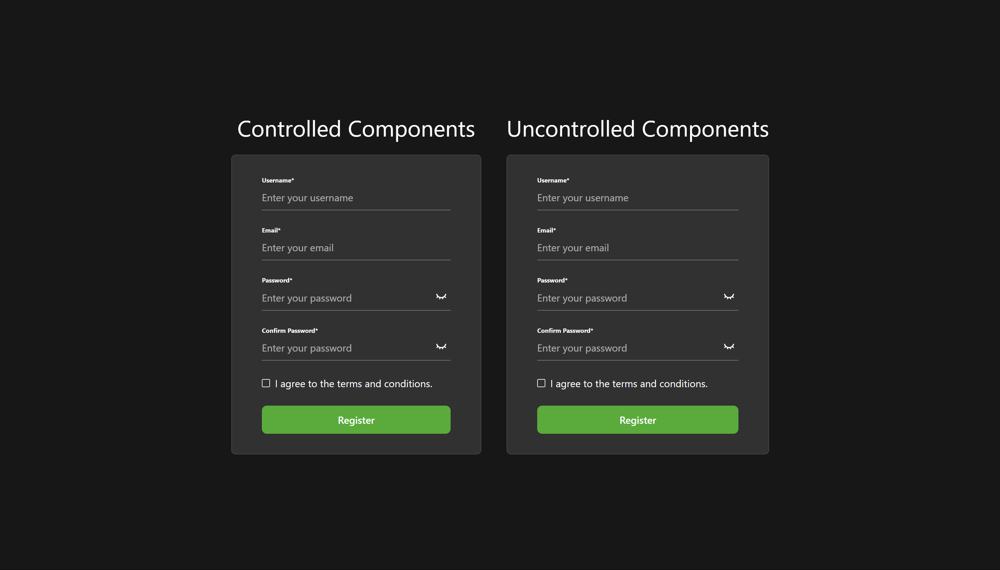
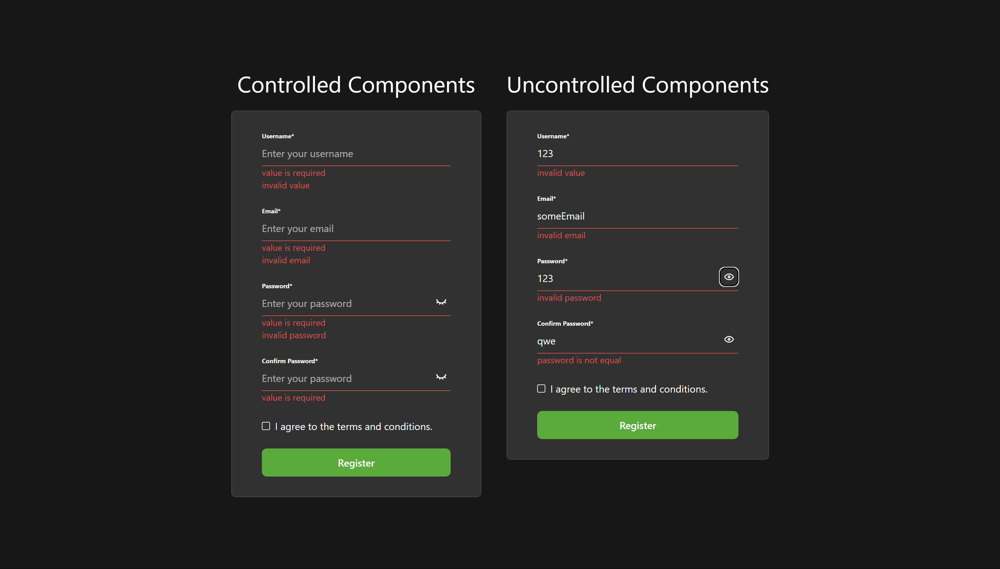

# 🚀 Forms

The goal of the task is to demonstrate the ability to work with various form management approaches.


## 🌟 Features

- Uncontrolled approach
- Controlled approach
- Custom input components (no UI libs were used)
- Custom validation

## 🛠️ Tech Stack

- React

## 🦾 Development

```
# To build the frontend app
npm run build

# To run the frontend app
npm run dev
```

## 🖼️ Gallery




---

[<< previous](https://github.com/DzmityKozich/courses-react/tree/main/task-3.2) [next >>](https://github.com/DzmityKozich/courses-react/tree/main/task-3.4)
