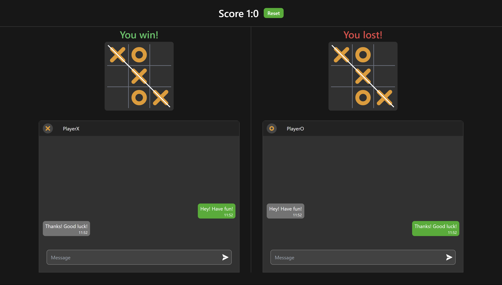

# 🚀 Tic-Tac-Toe game

A small **Tic-Tac-Toe** game


## 🌟 Features

- The screen is divided into two sides: one for "player X" and one for "player O".
- There is a score displayed at the top of the page; players can reset the score.
- In case of a victory by one of the players, the winning sequence will be crossed out, and _You win_ and _You lost_ messages will be shown.
- Players can communicate through a chat located below the playground.
- Each player will see the messages as if sent from their own perspective, similar to typical chat interfaces.
- Each message contains the message text and the time it was sent.

## 🛠️ Tech Stack

- React
- Tailwind
- Zustand
- Vite

## 🦾 Development

```
# To build the frontend app
npm run build

# To run the frontend app
npm run dev
```

---

[<< previous](https://github.com/DzmityKozich/courses-react/tree/main/task-3.3) [next >>](https://github.com/DzmityKozich/courses-react/tree/main/task-3.5)
