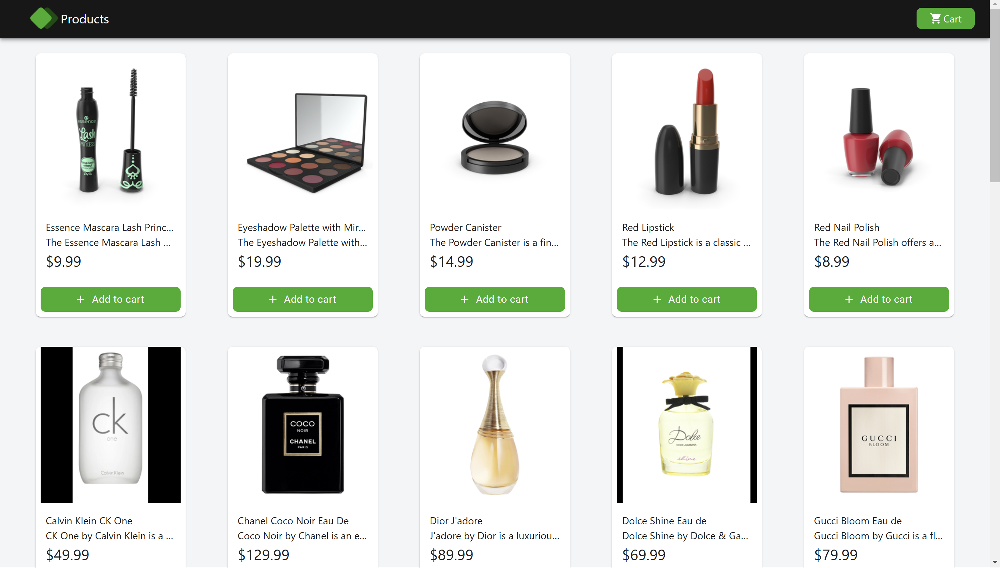
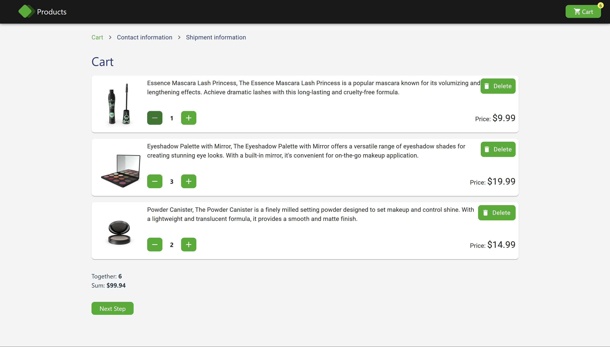
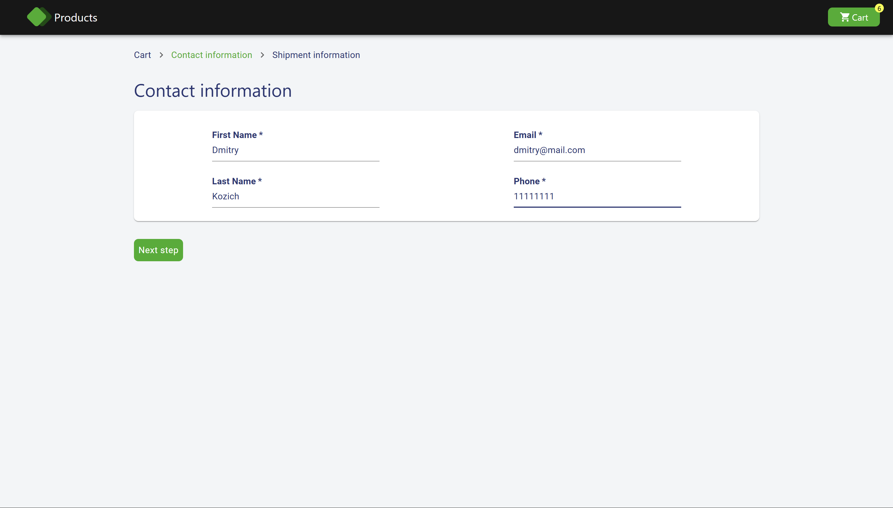
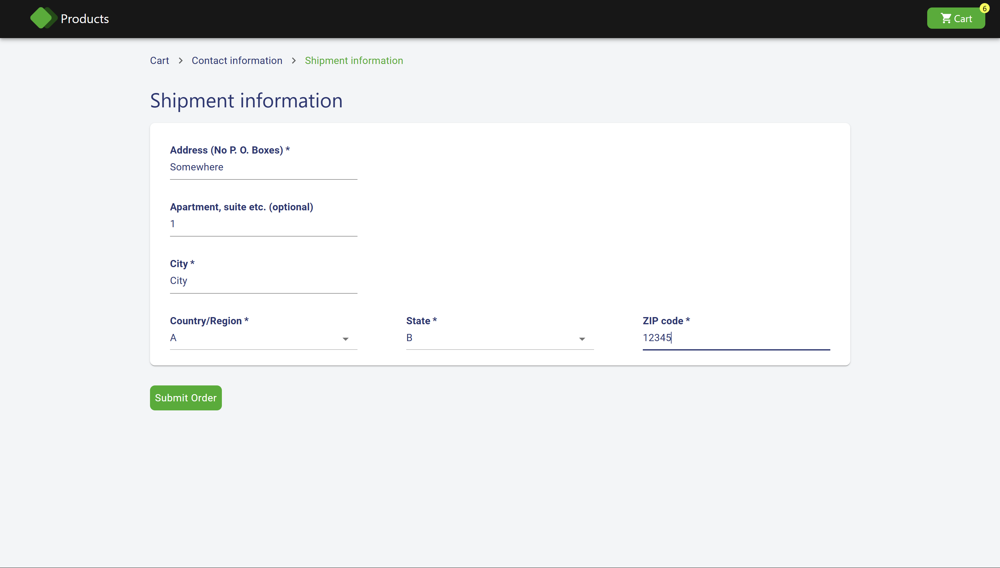
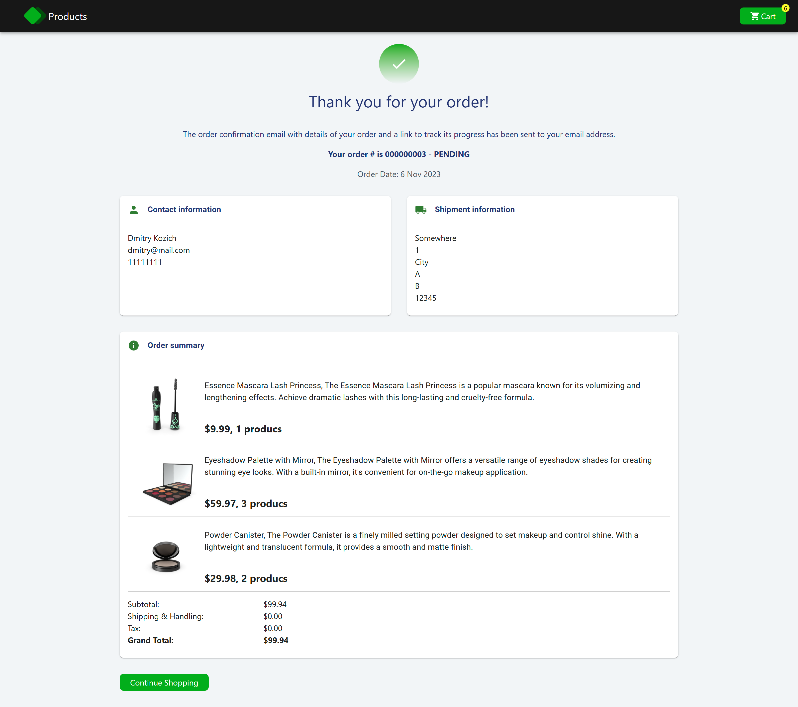

# 🚀 Store App

The Store App simulates the functionality of a marketplace. Users can browse and select products, add them to the cart, adjust the quantity of items, complete a contact and shipping form, and place an order.



## 🌟 Features

- The order form is divided into multiple steps (`Cart`, `Contact Form`, `Shipment Form`, `Order Info Page`).
- The checkout steps' state is stored in `location.state`.
- A router guard prevents users from navigating to the next form step unless the current form is valid.
- Validation is applied to the `Contact Form` and `Shipment Form`.
- Custom styles are implemented for `Material UI` components.
- A marker on the `Cart` button displays the number of items in the cart.

## 🛠️ Tech Stack

- React
- Tailwind
- Zustand
- Vite
- React Router
- Material UI
- Formik
- Yup

## 🦾 Development

```
# To build the frontend app
npm run build

# To run the frontend app
npm run dev
```

## 🖼️ Gallery


Products page


Cart page


Contact form page


Shipment form page


Order info page

---

[<< previous](https://github.com/DzmityKozich/courses-react/tree/main/task-3.4) [next >>](https://github.com/DzmityKozich/courses-react/tree/main/task-3.6)
