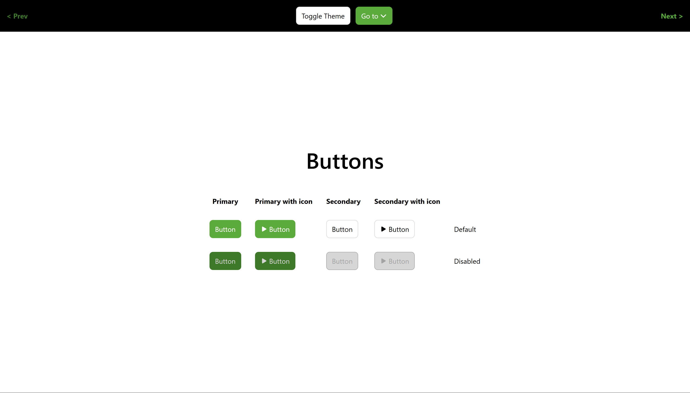
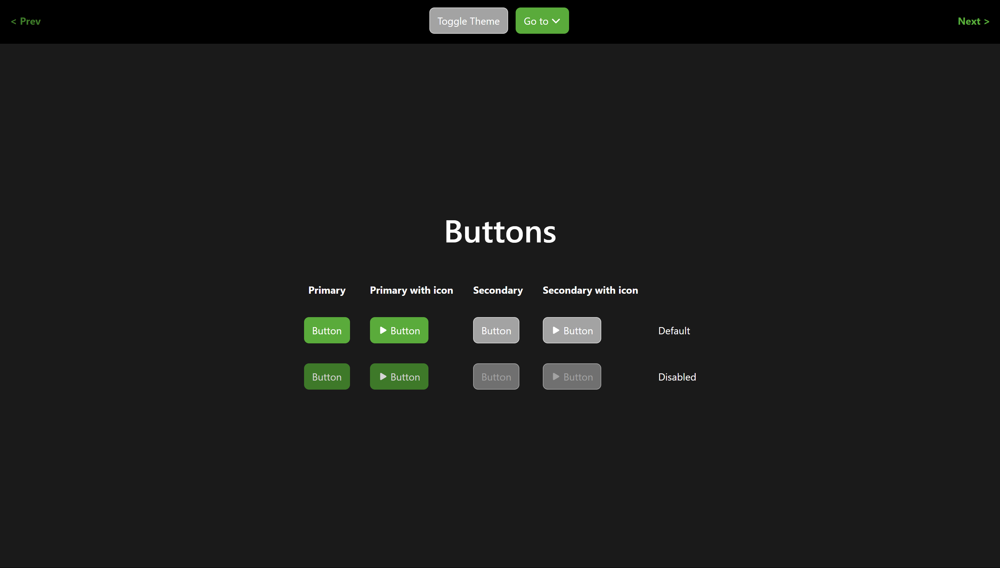
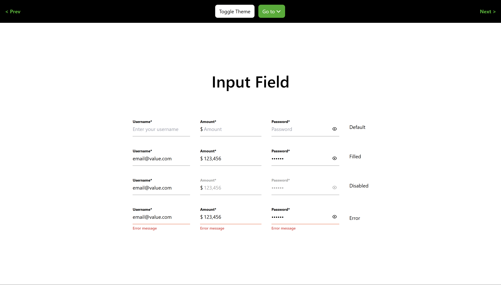
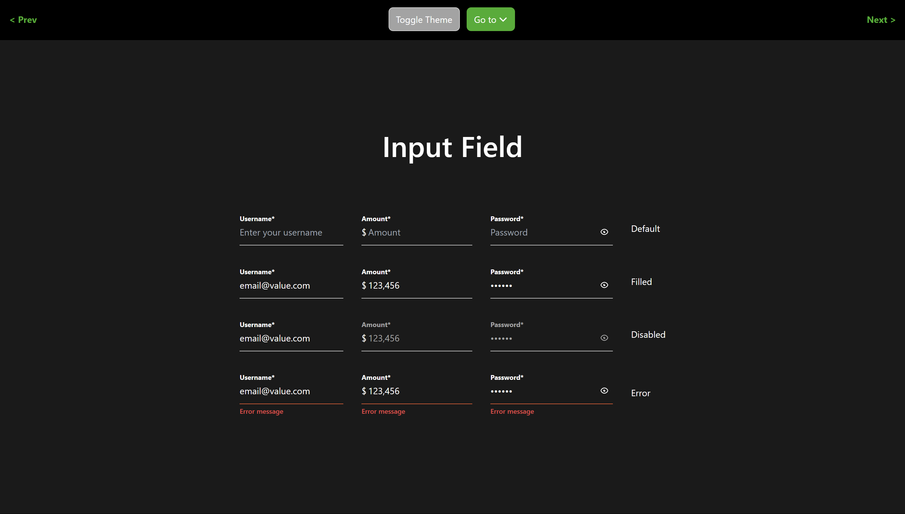
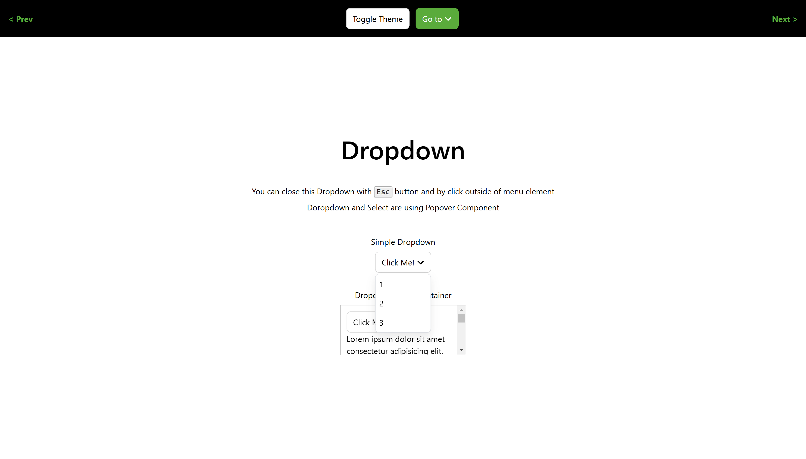
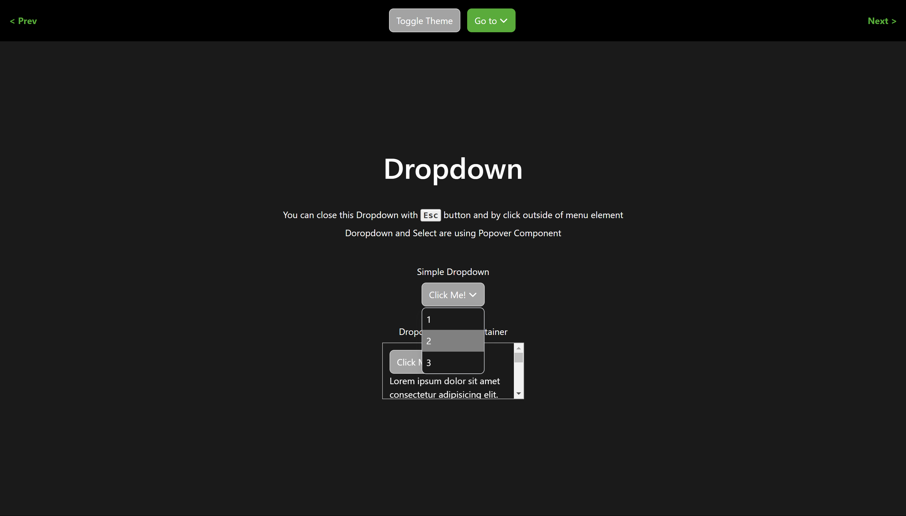
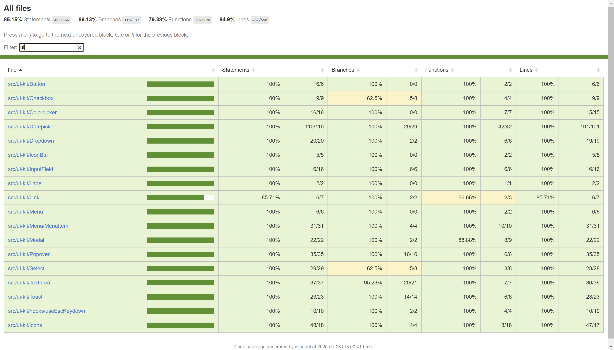

# 🚀 UI-Kit

A set of custom UI components designed to simplify interface creation in React. This includes task №3.7 - test coverage.




## 🌟 Features

- Button
  - Primary and Secondary themes
  - Support for start and end icons
- Icon Button
- Link
  - Disabled state support
- Input
  - Support for start and end adornments
  - Display `*` symbol next to the label for required fields
  - Help text
  - Error text
- Textarea
  - Support for start and end adornments
  - Display `*` symbol next to the label for required fields
  - Help text
  - Error text
  - Autosize functionality
- Checkbox
- Select
  - Created using the `Component Composition` pattern
- Dropdown
  - Created using the `Component Composition` pattern
- ColorPicker
  - Support for default values
  - Allows setting a custom color list in properties
- Modal
  - Created using the `Component Composition` pattern (`ModalBody`, `ModalHeader`, `ModalFooter` components)
- Datepicker
  - Support for default values
  - Allows setting a year range
  - Ability to select a specific year or month
- Toast
  - Control over Snackbar's position on the screen
- Light and Dark themes support
- Test coverage

## 🛠️ Tech Stack

- React
- Tailwind
- styled-components
- React Router
- Jest
- Vitest
- React Testing Library
- Vite

## 🦾 Development

```
# To build the app
npm run build

# To run the app
npm run dev

# To run tests
npm run test

# To run tests with coverage
npm run test:coverage
```

## 🖼️ Gallery


Buttons



Input Field



Dropdown


Test coverage

[See more here](./resources)

---

[<< previous](https://github.com/DzmityKozich/courses-react/tree/main/task-3.5) [next >>](https://github.com/DzmityKozich/courses-react/tree/main/task-3.8)
