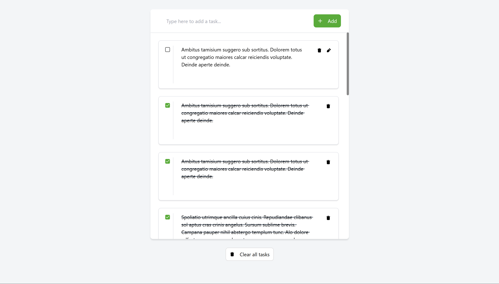

# TODO app

Client-server TODO app with async operations



## 🌟 Features

- The application uses the React Query API management library.
- The application implements the "optimistic update" pattern for create, edit, and delete operations.
- The application follows a microservice architecture with Node.js on the server side (using the Express.js framework).
- InversifyJS is used to manage dependency injection on the server side.
- It is possible to set a `.json` file or MongoDB as the database (see `example.env`).
- The `compose.yaml` file allows the app to be deployed in a Docker container.
- The application uses a UI kit from [task 3.6](https://github.com/DzmityKozich/courses-react/tree/main/task-3.6).

## 🛠️ Tech Stack

- React
- Tailwind
- React Redux
- Vite
- Node.js
- Express.js
- InversifyJS
- MongoDB
- Docker

## 🦾 Development

### Backend

```
cd backend

# To build the backend app
npm run build

# To run the backend app
npm run start
```

### Frontend

```
cd frontend

# To build the frontend app
npm run build

# To run the frontend app
npm run dev
```

---

[<< previous](https://github.com/DzmityKozich/courses-react/tree/main/task-3.6) [next >>](https://github.com/DzmityKozich/courses-react/tree/main/task-3.9)
