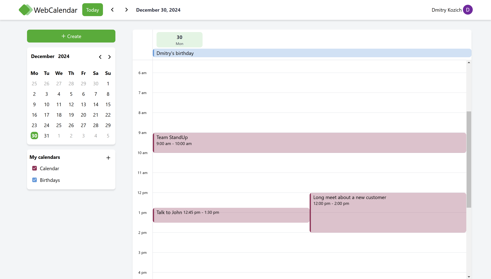
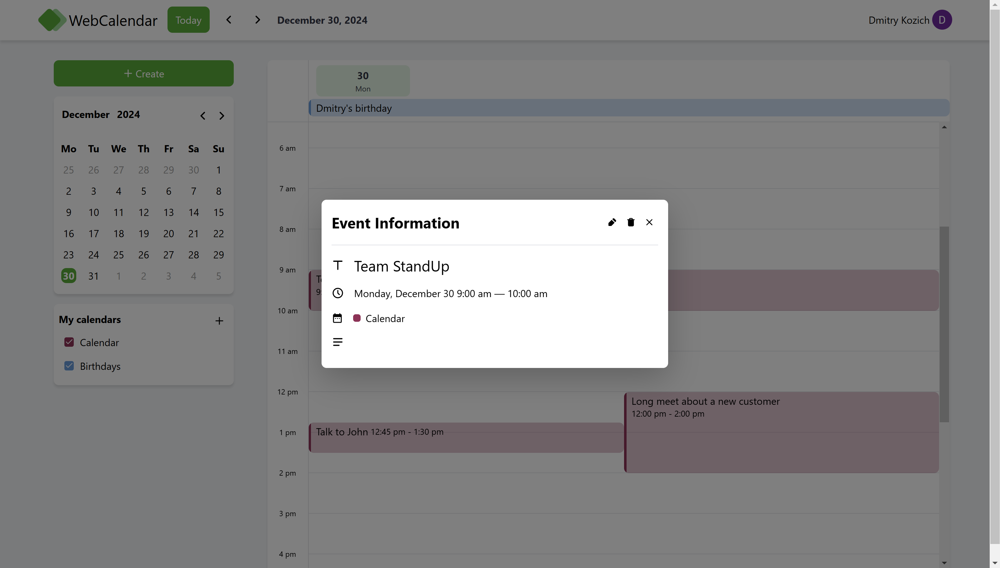
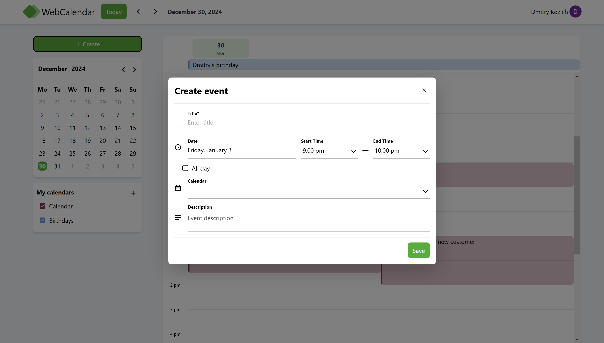
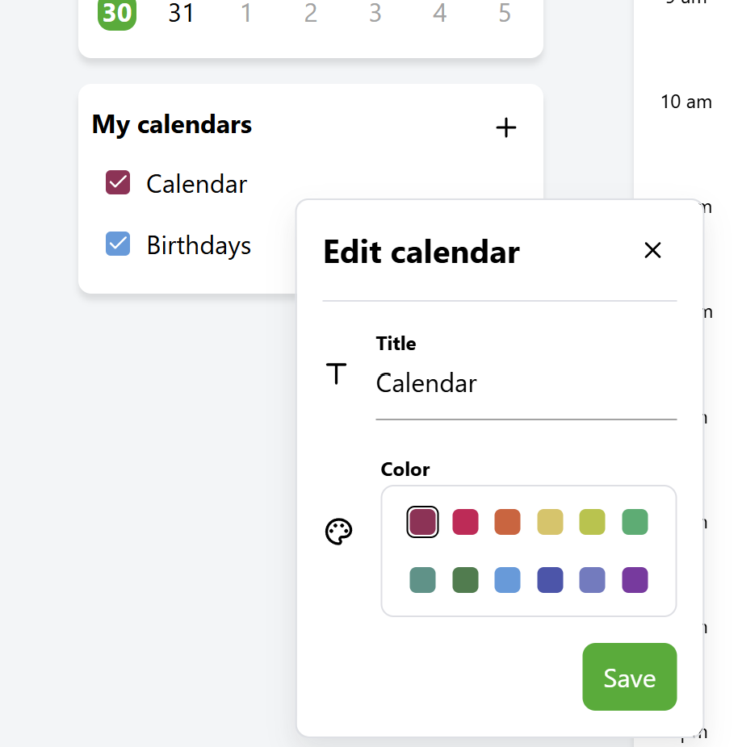

# 🚀 Calendar

A simple calendar application that mimics the functionality of Google Calendar. The application is built using React and Express.js technologies and follows the Feature-Sliced Design (FSD) architecture.



## 🌟 Features

- The application implements a microservice architecture with Node.js on the server side (using the Express.js framework) and React on the client side.
- The application uses a UI kit from [task 3.6](https://github.com/DzmityKozich/courses-react/tree/main/task-3.6).
- Built upon the FSD architecture methodology.
- CRUD functionality for calendars and events.
- The application uses prefetching to load calendar events.
- There is always a "default" calendar for the user, which cannot be deleted — only edited.
- The application uses Firebase for data storage and authentication.
- The calendar implements only the "Day" view.
- Each event has its own color, depending on the calendar it belongs to.
- An active red line shows the current time.
- Each event has a unique link, allowing users to share events.

## 🛠️ Tech Stack

- React
- Tailwind
- React Redux
- Vite
- Node.js
- Express.js
- Firebase

## 🦾 Development

### Backend

```
cd backend

# To build the backend app
npm run build

# To run the backend app
npm run start
```

### Frontend

```
cd frontend

# To build the frontend app
npm run build

# To run the frontend app
npm run dev
```

## 🖼️ Gallery


Event info


Create/Edit event


Create/Edit calendar

---

[<< previous](https://github.com/DzmityKozich/courses-react/tree/main/task-3.8)
